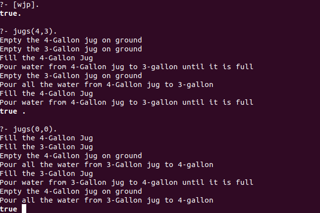

# Water-Jug-Problem
This is a solution for water jug problem using prolog.
 
This was an attempt to find the solution without the use of database which could not be found anywhere.
 

## Problem Statement
You are given two jugs, a 4-gallon one and a 3-gallon one, a pump which has unlimited water which you can use to fill the jugs and the ground on which water may be poured. Neither jug has any measuring markings on it.
How can you get exactly 2 gallons of water in the 4-gallon jug?
 

